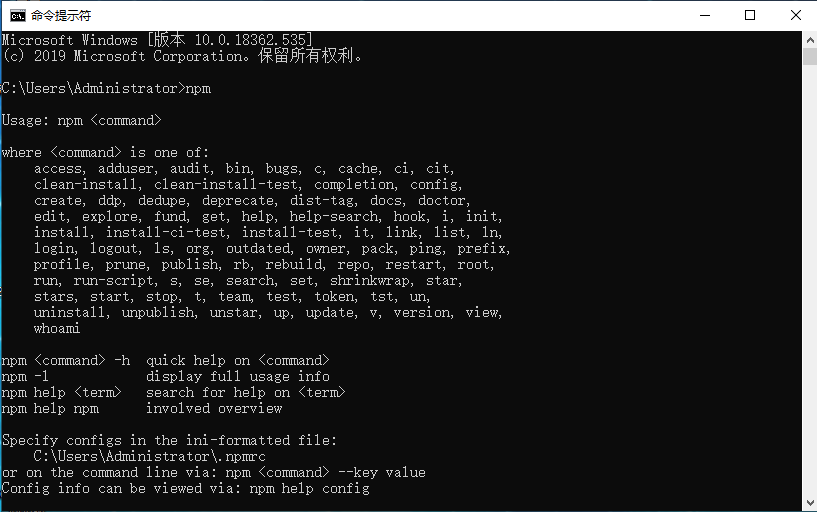
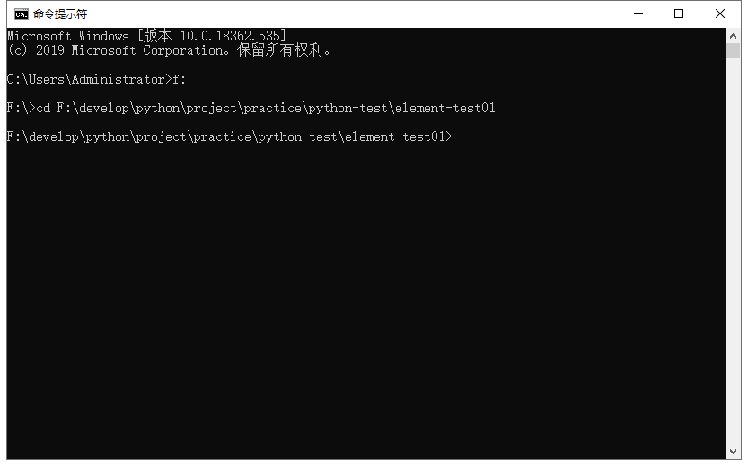
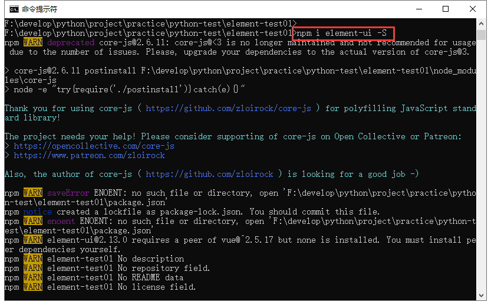

# element-test01项目说明
## element安装
>通过npm安装element

#### 首先要确保你已经安装了npm
`npm`是一种包安装工具；  
没安装请下载一个`node.js`安装工具，安装完了，npm工具就自动安装好了；  
可以通过cmd工具运行npm查看你的电脑是否安装成功没有；  

#### cmd工具cd到项目目录下

#### 运行nmp安装element
	npm i element-ui -S

#### 查看安装结果
如果安装成功，在项目文件夹里会自动生成如下文件夹及文件  

## 第一个element网页  
> HelloWorld

通过 CDN 的方式我们可以很容易地使用 Element 写出一个 Hello world 页面]

[helloworld.html](python-test/element/element-test01/helloworld.html)

## 快速上手

本节将介绍如何在项目中使用 Element。

