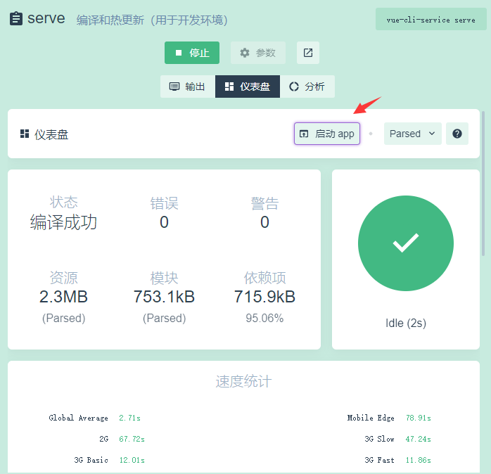
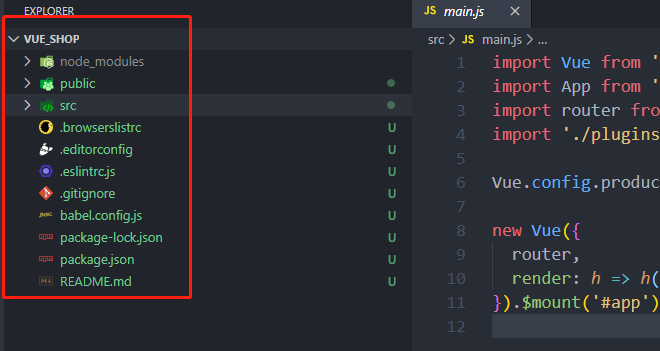

# element vue shop

## vscode小工具

+ 代码自动格式化
 - 安装ESlint插件
 - 设置保存自动代码格式化：打开setting json加入以下内容
  ```
  "editor.codeActionsOnSave": {
    "source.fixAll.eslint": true
  }
  ```


## 项目初始化

### 安装Vue脚手架

### 通过脚手架创建项目
+ vue ui
+ 创建新项目
+ 项目名称全英文

### 配置Vue路由
+ 选择预设：可以自己的预设，或手动
+ babel,router,linter/formatter,使用配置文件，打开其他都关闭先
+ use history mode 关闭
+ pick addtional lint：lint on save 开启

### 配置Element-UI库

+ 添加插件：vue-cli-plugin-element
+ 插件配置：fully import 修改为 import on demand

### 配置axios库

支持网络发起请求

+ 依赖中：安装依赖-添加依赖-搜-axios

## 后端安装

后端采用python flask

### 下载和使用postman

## 项目运行

### 启动vue ui

+ 左边工具栏：任务
+ 点击：serve
+ 点击：运行
+ 点击：启动app
+ 自动在默认浏览器启动首页



## 项目目录

项目主目录



+ `main.js`:入口文件

## Vue组件

### 创建一个login组件

+ 文件名称：Login.vue
+ 路径：`src/components/Login.vue`

```html
<template>
  <!-- 组件页面 -->
    <div class="vue1">
        {{ msg }}
    </div>
</template>

<script>
// 组件脚本
export default {
  data () {
    return {
      msg: '我是组件msg'
    }
  }
}

</script>

<style lang="less" scoped>

.vue1 {
  background-color: palegoldenrod;
}
</style>

```

+ template

 vue的页面模板，显示页面外观
 
+ script
  
 vue的脚本，包括页面的参数，函数等
 
+ style

 页面样式，只为该页面服务，`<style lang="less" scoped>`；
 - scoped：当一个style标签拥有scoped属性时候，它的css样式只能用于当前的Vue组件，可以使组件的样式不相互污染。如果一个项目的所有style标签都加上了scoped属性，相当于实现了样式的模块化。
 - lang="less":element-ui默认less为样式表,所以编译前，需要npm安装less组件
 
   `npm install less less-loader`
   
   也可以通过进入vue ui页面下，在项目依赖，开发依赖里，搜索 less less-loader进行图形化安装，需要重启动服务

### login组件注册

`src/rotuer/index.js`为该项目webpack的路由配置文件，在该文件中添加`login.vue`的路由	

```javascript
import Vue from 'vue'
import VueRouter from 'vue-router'

// 导入login组件
import Login from '../components/Login.vue'

Vue.use(VueRouter)

const routes = [
  { path: '/', redirect: '/login' },
  { path: '/login', name: 'login', component: Login }
]

const router = new VueRouter({
  routes
})

export default router
```

+ 导入组件：`import Login from '../components/Login.vue'`
+ 添加路由：`{ path: '/login', name: 'login', component: Login }`
 - path:添加一条路径为`/login`的路由
 - `{ path: '/', redirect: '/login' }`代表根目录自动重定向到该login路由
 - name:路由的名称
 - componet:组件名称
 
#### 路由中name属性用法
>1.通过name属性，为一个页面中不同的router-view渲染不同的组件,如：将上面代码的`login`渲染在 name为`login`的router-view中，将`home`渲染在name为`home`的router-view中。不设置name的将为默认的渲染组件。

```html
<template>
  <div id="app">
     <router-view></router-view>
     <router-view  name="login"></router-view> //将渲染login组件
     <router-view  name="home"></router-view>   //将渲染home组件
  </div>
</template>

```

>2.可以用name传参 使用$router.name获取组件name值

```html
 <template>
  <div id="app">
    <p>{{ $route.name }}</p> //可以获取到渲染进来的组件的name值
    <router-view></router-view>
  </div>
</template>

```

>3.用于pramas传参的引入 pramas必须用name来引入 query可以用name或者path来引入

```html
 var router = new VueRouter({
      routes: [
        { name:'register', path: '/register/:id/:name', component: register }
      ]
    })
   <router-link :to="{name:'register',params:{id:10,name:'lili'}}">注册</router-link>

```


### app.vue引入login组件

div中<router-view></router-view>添加路由组件占位符，启动app后默认进入login路由

```html
<template>
  <div id="app">
    我是app.vue
    <!-- router-view为路由站位符,渲染到router-view -->
    <router-view></router-view>
  </div>
</template>

<script>

</script>

<style>

</style>

```


## 编写样式

1. 编写全局容器样式，屏幕自动全屏
2. 编写login容器样式，100%高

### 编写全局容器样式

#### 建立全局css文件

+ 名称：`global.css`
+ 地址：`src/assets/css/global.css`
+ 编写全局样式内容：

 ```
 /* 全局样式表 */
 
 html, 
 body, 
 #app {
     height: 100%;
     margin: 0;
     padding: 0;
 }
 
 ```

#### 入口导入全局样式

import './assets/css/global.css'

#### 修改login的容器样式

div修改样式为：`class="login_container"`

建立一个`login_container`样式

```html
    <div class="login_container">
        {{ msg }}
    </div>	

.login_container {
    height: 100%;
    background-color: #2b4b6b;
}
```


## login登录盒子

### 登录框样式
在 login.vue页面中


```html
<div class="login_box"></div>

```

```css
.login_box {
  width: 450px;
  height: 300px;
  background-color: #ffffff;
  border-radius: 3px;
  position: absolute;
  left: 50%;
  top: 50%;
  transform: translate(-50%,-50%);
}

```

### 登录框头像样式

在上面基础上增加头像框样式

```css
.login_box {
  width: 450px;
  height: 300px;
  background-color: #fff;
  border-radius: 3px;
  position: absolute;
  left: 50%;
  top: 50%;
  transform: translate(-50%, -50%);
  .avatar_box {
    height: 100px;
    width: 100px;
    border: 1px solid #eee;
    border-radius: 50%;
    padding: 10px;
    box-shadow: 0 0 10px #ddd;
    position: absolute;
    left: 50%;
    transform: translate(-50%, -50%);
    background-color: #fff;
    img {
      width: 100%;
      height: 100%;
      border-radius: 50%;
      background-color: #eee;
    }
  }
}

```


### 正式启用element-ui

### element-ui组件导入

+ 组件目录:`src/plugins/element.js`
+ 组件导入：element的组件是按需导入的，用到哪个控件导入哪控件
+ element.js里导入需要的组件

```
import Vue from 'vue'
import { Button, Form, FormItem, Input } from 'element-ui'

Vue.use(Button)
Vue.use(Form)
Vue.use(FormItem)
Vue.use(Input)

```

### 登录框编写

```html
<template>
  <!-- 组件页面 -->
  <div class="login_container">
    <div class="login_box">
      <div class="avatar_box">
        
      </div>
      <!-- 登录表单区 -->
      <el-form  label-width="0px" class="login_form">
        <!-- 账号输入 -->
        <el-form-item>
          <el-input></el-input>
        </el-form-item>
        <!-- 密码输入 -->
        <el-form-item>
          <el-input></el-input>
        </el-form-item>
        <!-- 按钮区 -->
        <el-form-item class="btns">
           <el-button type="primary">确认</el-button>
           <el-button>重置</el-button>
        </el-form-item>
      </el-form>

    </div>
  </div>
</template>

<script>
// 组件脚本
export default {
  data () {
    return {
      msg: '我是组件msg'
    }
  }
}

</script>

<style lang="less" scoped>
.login_container {
  height: 100%;
  background-color: #2b4b6b;
}

.login_box {
  width: 450px;
  height: 300px;
  background-color: #fff;
  border-radius: 3px;
  position: absolute;
  left: 50%;
  top: 50%;
  transform: translate(-50%, -50%);
  .avatar_box {
    height: 100px;
    width: 100px;
    border: 1px solid #eee;
    border-radius: 50%;
    padding: 10px;
    box-shadow: 0 0 10px #ddd;
    position: absolute;
    left: 50%;
    transform: translate(-50%, -50%);
    background-color: #fff;
    img {
      width: 100%;
      height: 100%;
      border-radius: 50%;
      background-color: #eee;
    }
  }
}

.login_form {
  position: absolute;
  bottom: 0;
  width: 100%;
  padding: 0 20px;
  box-sizing: border-box ;
}
.btns {
  display: flex;
  justify-content: flex-end;
}

</style>

```
