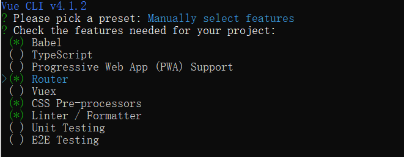

# vue-cli4使用教程
vue-cli是vue的脚手架，自动化生产vue项目目录,目前最新版本4；
## vue-cli4安装
>通过npm安装vue-cli4

#### 运行nmp安装vue-cli4
运行 cmd，cd到项目目录下
	
	npm install -g @vue/cli

#### 查看安装结果
	
	vue --version

## 创建第一个vue项目  
> vue-demo

#### 项目创建命令
	
	vue create vue-demo

#### 弹框询问是否使用淘宝镜像

输入` Y `回车

#### 选择手动配置还是自动配置模式

+ default  
+ Manually

通过箭头上下来进行选择，这里选择`Manually`手动的方式

#### 手动选择配置项
+ `Bable` ES6语法转换，必选
+ `TypeScript` 脚本语言，可以不选
+ `Progressive Web App(PWA) Support` webApp支持
+ `Router` 路由管理,必选
+ `Vuex`
+ `CSS Pre-processors `CSS预处理器
+ `Linter / Formatter` 统一代码格式，必选
+ `Unit Testing` 单元测试
+ `E2E Testing` 端对端测试

以上内容按空格选择或取消，按回车确认进入下一步

#### 选择是否使用默认路由

这里选择` n `

#### 选择CSS预处理器

选择`Less`

#### 选择统一编码格式

选择标准编码自动格式化

#### 选择编码检查的时机

+ `Lint on save` 保存的时候检查，建议选择
+ `Lint and fix on commit` 提交到git的时候检查

这里选择`Lint on save`

#### 选择配置信息文件存放方式

你是喜欢把Babel、ESLint等配置信息全放在package.json文件里呢，还是单独文件管理？

+ `In dedicated config files` 单独一个个文件保存
+ `In package.json` 放到一个json文件夹里

这里选择 `In dedicated config files`，还是一个个放分的清楚

#### 预设置是否保持起来下次可以使用

这里选择`y`,并起个名称保存，如my_preset,下次新建项目就会多出一个my_preset的选项

#### 项目安装完成

多出一个vue-demo文件夹

## CLI 4的目录结构
#### 目录

其实通过阅读CLI 3的官方文档，你可能已经知道，官方内置了一个CLI服务

	@vue/cli-service
	
作为一个开发环境的依赖，局部安装在`@vue/cli`创建的项目中
如果你真想修改webpack的相关配置，可在项目的根目录下（和`package.json`同级）创建一个`vue.config.js`配置文件
这个文件一旦存在就会被`@vue/cli-service`自动加载。也可直接使用`package.json`中的vue字段。

## 启动项目

cd 进入项目目录

	npm run serve

看到以下页面代表项目运行成功

