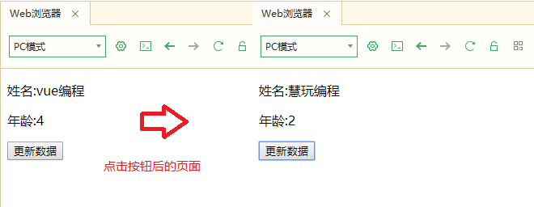

# vue基本教程


## 初识Vue


#### Vue的安装和使用

在网页中使用Vue有两种方式  
+ 第一种方式通过html内引入（新手推荐）
		<script src="https://cdn.jsdelivr.net/npm/vue/dist/vue.js"></script>
+ 第二种方式通过npm等第三方库程序安装vue cli脚手架（高手进阶推荐，现在不知道什么叫脚手架可以不用深究）

#### 第一个Vue实例：Hello World

国际惯例，第一个实例从Hello World开始

+ 新建立一个html，命名为101HelloWorld.html
+ 添加以下内容到html中
```html
		<!DOCTYPE html>
		<html>
			<head>
				<meta charset="utf-8">
				<!-- 引入vue.js -->
				<script src="https://cdn.jsdelivr.net/npm/vue/dist/vue.js"></script>
				<title>Hello World</title>
			</head>
			<body>
				<div id="app">
					<p>{{ message }}</p>
				</div>
				<script>
					new Vue({
						el: "#app",
						data: {
							message: "Hello World"
						}
					})
				</script>
			</body>
		</html>
```
运行浏览器，你将看到浏览器输出`Hello World`，现在可以你不用知道这些神奇的事情是怎么发生的，只要能通过案例输出`Hello World`即可。


#### 第二个Vue实例：编程语言列表

+ 新建立一个html，命名为102.html
+ 添加以下内容到html中
```html
		<!DOCTYPE html>
		<html>
			<head>
				<meta charset="utf-8">
				<!-- 引入vue.js -->
				<script src="https://cdn.jsdelivr.net/npm/vue/dist/vue.js"></script>
				<title>编程语言列表</title>
			</head>
			<body>
				<div id="app">
					<p>{{ code }}</p>
					<ul>
						<li v-for=" tab in tabs">
							{{ tab.text }}
						</li>
					</ul>

				</div>
				<script>
					new Vue({
						el: "#app",
						data: {
							code:"编程语言列表",
							tabs: [
								{text: 'java'},
								{text: 'python'},
								{text: 'javascript'},
								{text: 'C'},
								{text: 'C++'},
								{text: 'PHP'}
							]
						}
					})
				</script>
			</body>
		</html>
```
		

这个是用到了Vue循环功能的实例，可以非常方便的生成一个列表。


## 数据绑定

数据绑定是将`数据`和`视图`相关联，当数据发生变化时，可以自动更新视图。

Hello World案例中：

	<div id="app">
		<p>{{ message }}</p>
	</div>
	<script>	
		new Vue({
			el: "#app",
			data: {
				message: "Hello World"
			}
		})	
	</script>

以上代码中，`<div>..</div>`内我们称为视图区，`<scrip></scrip>`内我们称为脚本区或代码区


+ 数据绑定

  `{{ message }}`是一个标准的数据绑定显示方式,通过`message`这个变量，可以在html标签内动态显示，一旦数据有变化，页面也是自动更新,`{{ message }}`建议标准写法是变量名与大括号之间隔1个空格。
 
+ id绑定

  `div id="app"`是html中div元素的id的名称，该id名称要与vue代码块中的变量`el: "#app"`一致,表示该vue是为id为"app"的DOM元素服务。el变量前面需要加一个#号,id命名可以随意命名，不一定要命为“app”。

+ vue脚本
	- vue脚本代码都写在`<scrip></scrip>`代码对中；
	- new Vue({..})表示新创建一个vue对象，该对象也可以赋值给一个变量；
	- el:"#app"表示绑定的html中的DOM元素，所有操作只对在该元素范围内有效；
	- data:{message: "Hello World"}，为vue对象的data变量，该变量以`键值对`形式存在。


#### 数据绑定实例：自动更新数据

+ 新建立一个html，命名为201.html
+ 添加以下内容到html中  
从本章节开始，标准的html内容不再重复添加，代码块仅显示案例有用的内容，其他html标签内容请参考第一章两个案例。
```html
		<div id="app">
			<p>姓名:{{ name }}</p>
			<p>年龄:{{ age }}</p>
			<button v-on:click="name='慧玩编程',age=2 ">更新数据</button>
		</div>
		<script>
			var vm = new Vue({
				el:"#app",
				data:{
					name:"vue编程",
					age:4				
				}
			})			
		</script>
```



通过`<button v-on:click="name='慧玩编程',age=2 ">`对变量进行了重新赋值的操作，点击按钮后，页面没有刷新，数据自动更新了。
通过这个简单的例子我们就初步体会到Vue的强大，以往html、javascript编程，想要实现页面元素动态更新数据，需要编写一堆的代码，现在只需要简简单单几句代码即可完成。

## 数据与方法

#### 数据绑定实例：data数据绑定

对data元素进行绑定测试

+ 新建立一个html，命名为202.html
+ 添加以下内容到html中  

官方手册，都用vm代表Vue的实例

```html
<!DOCTYPE html>
<html>
	<head>
		<meta charset="utf-8">
		<!-- 引入vue.js -->
		<script src="https://cdn.jsdelivr.net/npm/vue/dist/vue.js"></script>
		<title>vue data</title>
	</head>
	<body>
		
		<div id="app">
			<p>data数据案例</p>
			<p>name:{{ name }}</p>
			<p>age:{{ age }}</p>
			<button v-on:click="age++"> 年龄++</button>
		</div>
		
		<script>
			var data = {
				name:"allen",
				age:16
				
			}			
			var vm = new Vue({
				el: "#app",
				data:data
			})
			
			data.age = 20
			vm.age = 21
			
		</script>
		
	</body>
</html>

```

这个案例在script中定义了一个变量 data（它是一个对象变量）,变量中有两个属性name和age

vue中的data属性是变量data，这两个是不一样的，注意区分，
data.age代表变量属性age，
vm.age 代表vue中的属性age，因为data变量赋值给了vue，所以两个指向是一样的。

	data.age = 20
	vm.age = 21

改变了同一个属性值

### 小知识：对象变量

javascript创建对象有两种方式：

+ 方式一：new操作符后跟Object构造函数
	
 ```html
	var person = new Object();
	person.name="allen";
	person.age="16";
	
 ```
  
+ 方式二:对象字面量表示法
	
 ```html
	var person = {
		name="allen",
		age="16"
	}
	
 ```

#### JavaScript对象实例

+ 新建立一个html，命名为203.html
+ 添加以下内容到html中  

结合vue测试对象

```html
		<div id="app">
			<p>script对象person1</p>
			<p>person1.name:{{name}}</p>
			<p>person1.name:{{age}}</p>			

		</div>
		
		<div id="app2">
			<p>script对象person2</p>
			<p>person2.name:{{name}}</p>
			<p>person2.name:{{age}}</p>
		</div>
		
		<script>
			var person1 = new Object();
			person1.name ="allen"
			person1.age = 16
	
			var vm = new Vue({
				el: "#app",
				data:person1
			})
			
			var person2 ={
				name : "zhang san",
				age : 22
				
			}
			
			var vm2 = new Vue({
				el: "#app2",
				data:person2
			})
						
			
			
		</script>

```


### 实例属性与方法

它们都有前缀 $，以便与用户定义的属性区分开来

vm.$el === document.getElementById('example') 

### JavaScript小知识：全等===操作符

"55"==55 true，经过转换数值相等，返回true

"55"===55 false 不经过转换数值不相等，返回false


"55"!=55 false，经过转换数值相等，返回false

"55"!==55 false 经过转换数值不相等，返回false


### watch方法

一个对象，键是需要一个变量，如有变化，可以输出变化前和变化后的值

#### watch实例

+ 新建立一个html，命名为204.html
+ 添加以下内容到html中  

```html
<script>
			var person = {
				name: "allen",
				age: 22

			}

			var vm = new Vue({
				el: "#app",
				data: person
			})
			
			vm.$watch('name', function(newVal, oldVal) {
				console.log('new is %s,old is %s', newVal, oldVal)
			})
			
			vm.$data.name="Tom"
		</script>
```


### 生命周期

生命周期就是页面的监控事件

具体参考API
+ 参考205.html


### 语法

+ 参考206.html

#### 文本插值
+ 使用双括号`{{}}`(类似于Mustache，称作Mustache标签)
		<p>姓名:{{ name }}</p>
  当标签中name属性变化时，页面跟着联动
  

#### 原始html
+ 双大括号会将数据解释为普通文本，而非 HTML 代码。为了输出真正的 HTML，你需要使用 v-html 指令：
```html
	<p>Using mustaches: {{ rawHtml }}</p>
	<p>Using v-html directive: <span v-html="rawHtml"></span></p> 
```

#### Attribute
+ HTML标签属性自动生成

Mustache 语法不能作用在 HTML attribute 上，遇到这种情况应该使用 v-bind 指令：
```html
	<div v-bind:id="dynamicId"></div>
```

