# vue基本教程

## 指令
	
	指令是vue中带有v-前缀的名称，指令是为了绑定表达式，当表达式的值发生改变时把某些特殊的行为应用到DOM上。
	
### v-if

 `v-if`是最常见的指令，用于判断表达式是否为true，如果为true，执行绑定元素的内容，否则不执行。

#### v-if实例：v-if操作
+ 新建立一个html，命名为301.html
+ 添加以下内容到html中  
```html
		<div id="app">
			<p v-if="man">是男人就学Vue</p>
			
			<button v-on:click="man=true">是男人</button>
		</div>
		<script>
			var vm = new Vue({
				el:"#app",
				data:{
					man:false				
				}
			})			
		</script>
```
+ v-if指令要绑定到指定的元素中，v-if="...",引号内容为表达式，man值默认为false，所以`<p>`标签中的内容不显示；
+ 点击按钮后，man值更新为true， `<p>`标签绑定了v-if,自动判别man值为true，内容也跟着显示出来了。

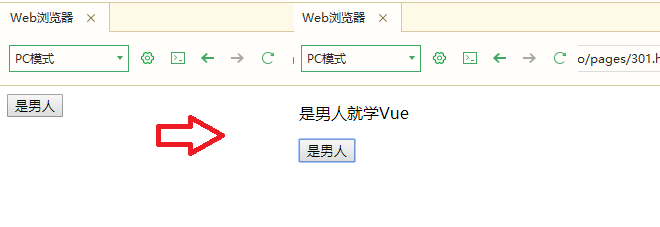


### v-else

 `v-else`要搭配`v-if`或`v-if-else`使用才有效，当v-if表达式内容为false后要操作的内容。
	
#### v-else实例：v-else操作
+ 新建立一个html，命名为302.html
+ 添加以下内容到html中  
```html
		<div id="app">
			<p v-if="man">是男人就学Vue</p>
			<p v-else>是女人也要学Vue</p>
			
			<button v-on:click="man=true">是男人</button>
		</div>
		<script>
			var vm = new Vue({
				el:"#app",
				data:{
					man:false				
				}
			})			
		</script>
```
+ man值默认为false,显示的内容为v-else绑定的标签，点击按钮后就显示为v-if绑定的标签内容


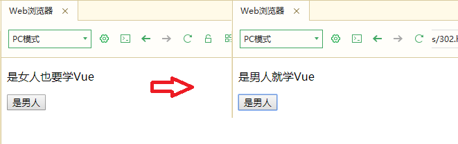

### v-else-if

`v-else-if`必须要与v-if搭配使用，单独无法使用。
+ v-if="..." 结果为false才会执行下一步；
+ v-else-if="..."，表达式内结果为true，执行标签内容；
+ v-else 以上表达式都为false，才会执行v-else绑定的标签内容。

#### v-else-if实例：v-else-if操作

+ 新建立一个html，命名为303.html
+ 添加以下内容到html中  
```html
		<div id="app">
			<p v-if="man">是男人就学Vue</p>
			<p v-else-if="women">是女人也要学Vue</p>
			<p v-else>既然是动物就免学Vue了</p>
			
			<button v-on:click="man=true,women=false">是男人</button>
			<button v-on:click="man=false,women=true">是女人</button>
			<button v-on:click="man=false,women=false">是动物</button>
		</div>
		<script>
			var vm = new Vue({
				el:"#app",
				data:{
					man:false,
					women:false
				}
			})			
		</script>
```
 该案例，一共有三`<p>`标签，三个按钮，vue对象中有man和woman两个变量，默认都是false，点击不同按钮将改变man和women两个变量的值，同时通过v-if、v-else等指令来判断条件。
 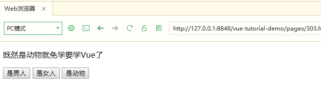
 

### v-show

根据表达式之真假值，切换元素的 display CSS 属性,作用效果和v-if很相似。

#### v-show实例：v-show操作

+ 新建立一个html，命名为304.html
+ 添加以下内容到html中 
```html
		<div id="app">
			<p v-show="man">是男人就学Vue</p>
			
			<button v-on:click="man=true">是男人</button>
		</div>
		<script>
			var vm = new Vue({
				el:"#app",
				data:{
					man:false				
				}
			})			
		</script>
```
+ 以上代码为301实例中的v-if修改为v-show

> v-show和v-if的区别
 + v-show实例的`检查元素`查看
	- 网页右键，选择【检查元素】或叫【查看元素】
	 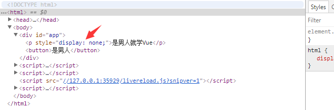
	- 使用v-show标签CSS状态是被设置成不可见，内容都是存在的；
 + v-if实例的`检查元素`查看
	- 网页右键，选择【检查元素】或叫【查看元素】
	 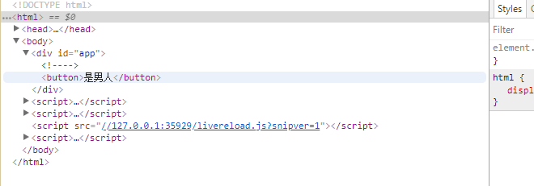
	- 使用v-if,false状态下，整个标签都不存在；
 + 区别
	- 相对来说，v-show相对来说比较简单，标签元素始终被保留，只是简单的基于CSS的显示切换;
	- v-if有更高的消耗，但v-if可以和v-else等指令组合使用，使用更灵活;
	- v-show不支持`<template语法>`;

### v-text
更新元素的 textContent。
```html
<span v-text="msg"></span>
<!-- 和下面的一样 -->
<span>{{msg}}</span>
```

### v-html
用于更新元素的innerHTML,内容按普通HTML插入(如果看不懂，请看以下实例)

#### v-html实例：v-html操作

+ 新建立一个html，命名为305.html
+ 添加以下内容到html中
```html
		<div id="app">
			<p>{{htext}}</p>
			<p v-html="htext"></p>			
		</div>
		<script>
			var vm = new Vue({
				el:"#app",
				data:{
					htext:"<h1>我是标题1</h1>"				
				}
			})			
		</script>
```

 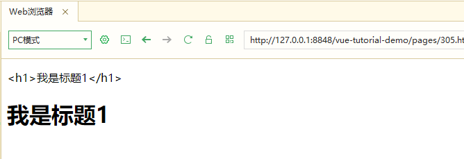
 
 + `<p>{{htext}}</p>`输出的是文本内容
 + `<p v-html="htext"></p>`输出的是带html标签的内容
 + 以上就是启用v-html的作用
 
### v-for
for循环指令和v-if是vue中最常用的几个指令，此指令之值，必须使用特定语法 alias in expression ，为当前遍历的元素提供别名。

#### v-for实例：v-for基本迭代

+ 新建立一个html，命名为306.html
+ 添加以下内容到html中

```html
		<div id="app">
			<p>{{ text }}</p>
			<ul>
				<li v-for=" item in items">
					{{ item.text }}
				</li>
			</ul>
		</div>
		<script>
			new Vue({
				el: "#app",
				data: {
					text:"程序猿六大标签",
					items: [
						{text: '秃头'},
						{text: '格子衫'},
						{text: '邋遢'},
						{text: '死宅'},
						{text: '无趣'},
						{text: '动漫'}
					]
				}
			})
		</script>
```

 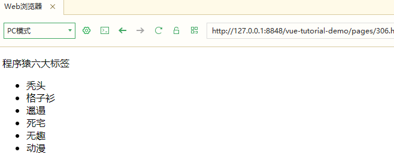
 
 + `v-for=" item in items"`命名一个变量item,通过v-for历遍items数组中的对象；
 + `{{ item.text }}`每次循环，通过该方法输出item对象的text值；
 + 以上就是启用v-html的作用
 
#### v-for实例：v-for多参数（参数1，参数2，参数3）

在v-for指令中，可以指定参数2和参数3，参数2代表键值对名称，参数3代表循环的序号

+ 新建立一个html，命名为307.html
+ 添加以下内容到html中

```html
		<div id="app">
			<h2>v-for 来遍历一个对象的属性</h2>
			<p>{{ coder.name }}</p>
			<ul>
				<li v-for=" item in coder">
					{{ item }}
				</li>
			</ul>
			
			<h2>你也可以提供第二个的参数为 property 名称 (也就是键名)</h2>
			<h4>用name来输出键名，该参数可以重命名</h4>
			<p>{{ coder.name }}</p>
			<ul>
				<li v-for=" (item,name) in coder">
					{{ name }}:{{ item }}
				</li>
			</ul>
			
			<h2>还可以用第三个参数作为索引</h2>
			<h4>用index来输出索引,该参数可重命名</h4>
			<p>{{ coder.name }}</p>
			<ul>
				<li v-for=" (item,name,index) in coder">
					{{ index }}.{{ name }}:{{ item }}
				</li>
			</ul>
								
		</div>
		<script>
			new Vue({
				el: "#app",
				data: {
					coder:{
					name:"一个苦逼的程序猿",	
					age:35,
					address:"浙江某山洞",
					habit:"漂亮的姑娘",
					}					
				}
			})
		</script>
```

 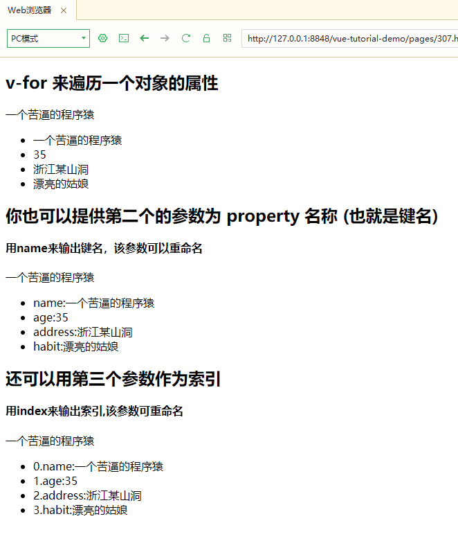
 
 + `(item,name)`第二个参数name为键名，如coder键值对中的name、age等，不一定用name命名，可以任意取变量名。
 + `(item,name,index)`第三个参数index为循环序号，每次循环，通过该方法输出序号，不一定要用index，可以任意取变量名；

 
 #### v-for实例：v-for迭代实例
 
 普通数组，对象数组，迭代对象、迭代数字的演示说明
 
+ 新建立一个html，命名为308.html
+ 添加以下内容到html中

 ```html
 <div id="app">
 	<p>迭代普通数组:</p>
 	<p v-for="(item,i) in list">--索引值--{{i}}   --每一项--{{item}}</p>
 	<p>迭代对象数组:</p>
 	<p v-for="(user,i) in listObject">--id--{{user.id}}   --姓名--{{user.name}}</p>
 	<p>迭代对象:</p>
 	<p v-for="(val,key) in user">--键是--{{key}}  --值是--{{val}}</p>			
 </div>
 <script>
 	new Vue({
 		el: "#app",
 		data: {
 			list:[1,2,3,4,5,6],
 			listObject:[
 				{id:1,name:"唐三藏",age:40},
 				{id:2,name:"孙悟空",age:35},
 				{id:3,name:"猪悟能",age:25},
 				{id:4,name:"沙悟净",age:23},
 				{id:5,name:"敖烈",age:21},
 			],
 			user:{
 				id:1,
 				name:"白晶晶",
 				age:18						
 			}					
 		}
 	})
 </script>
``` 
 
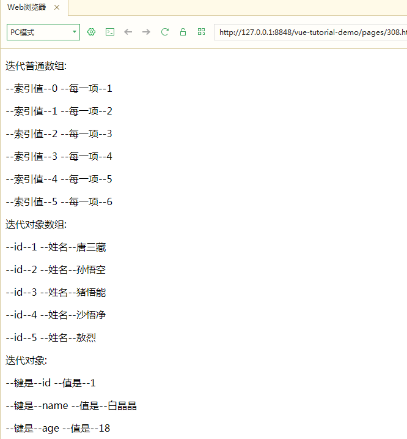
  
  
 ### v-model 
 
数据双向绑定,一般用于input、textarea、select中使用，它其实是一个语法糖。

 #### v-model 实例：v-model双向绑定input
 
+ 新建立一个html，命名为309.html
+ 添加以下内容到html中

 ```html
		<div id="app">	
			<p>输入名字：<input v-model="user.name" /></p>
			<p>v-model绑定的名字:{{ user.name }}</p>
			
		</div>
		<script>
			new Vue({
				el: "#app",
				data: {
					user:{
						id:1,
						name:"白晶晶",
						age:18						
					}					
				}
			})
		</script>
 ``` 


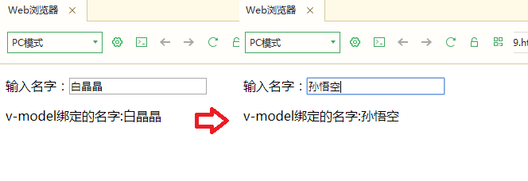
在输入框改变输入的文字后，绑定的对象`name`属性也跟着变化。

v-mode可以添加修饰符，获得意想不到的效果

+ .lazy

 在默认情况下， v-model 在 input 事件中同步输入框的值与数据，但你可以添加一个修饰符 lazy ，从而转变为在 change 事件中同步：
 在 "change" 而不是 "input" 事件中更新
 ```html
 <input v-model.lazy="msg" >
  ```

+ .trim

 如果要自动过滤用户输入的首尾空格，可以添加 trim 修饰符到 v-model 上过滤输入：

 ```html
 <input v-model.trim="msg">
 ```
 
+ .number

 如果想自动将用户的输入值转为 Number 类型（如果原值的转换结果为 NaN 则返回原值），可以添加一个修饰符 number 给 v-model 来处理输入值：
 
 ```html
 <input v-model.number="age" type="number">
 ```

 #### v-model 实例：v-model双向绑定select
 
+ 新建立一个html，命名为310.html
+ 添加以下内容到html中

 ```html
 <div id="app">
 	<p>下拉框</p>
 	<select v-model="selected">
 		<option v-for="item in items" :label="item.name" :value="item"></option>
 	</select>
 	<p>Select:id:{{ selected.id }}</p>
	<p>name:{{ selected.name }}</p>			
 </div>
 <script>
 	new Vue({
 		el: "#app",
 		data: {
 			selected:'',
 			items:[
 				{id:1,name:"白晶晶"},
 				{id:2,name:"孙悟空"},
 				{id:3,name:"猪悟能"},
 			]										
 		}				
 	})
 </script>
 ```

 该实例通过v-model绑定了一个vue对象中的`selected`对象,通过v-for循环将item对象绑定到option中，在其他标签中可以调用`selected`,以此来显示所需要的值。
 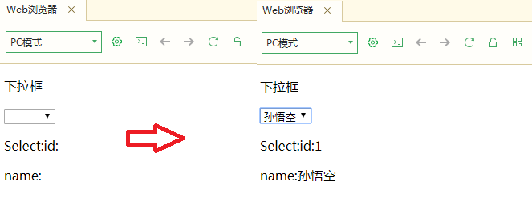
 
 选择下拉框的时候，可以获得id值和name值。
 
#### v-model 实例：v-model双向绑定单选框
 
+ 新建立一个html，命名为311.html
+ 添加以下内容到html中


 ```html
 	<div id="app">	
 		<p>单选框</p>
 		
 		  <input type="radio" id="small" value="small_value" v-model="picked">
 		 <!-- for属性要与上面id属性一致 -->
 		  <label for="small">small</label>
 		  <br>
 		  
 		  <input type="radio" id="big" value="big_value" v-model="picked">
 		  <label for="big">big</label>
 		  <br>		
 		<p>picked:{{ picked }}</p>		
 		
 	
 	</div>
 	<script>
 		new Vue({
 			el: "#app",
 			data: {
 				picked:''									
 			}				
 		})
 	</script>
 ```
 
 
 
#### v-model 实例：v-model双向绑定复选框
 
+ 新建立一个html，命名为312.html
+ 添加以下内容到html中


 ```html
 <div id="app">
 	<p>复选框</p>			
 	<input type="checkbox" id="one" :value="items[0].id" v-model.lazy="checkedNames">
 	<label for="one">{{ items[0].name }}</label>
 	<input type="checkbox" id="two" :value="items[1].id"  v-model.lazy="checkedNames">
 	<label for="two">{{ items[1].name }}</label>
 	<input type="checkbox" id="three" :value="items[2].id"  v-model.lazy="checkedNames">
 	<label for="three">{{ items[2].name }}</label>
 	<br>			
 	<span>Checked names: {{ checkedNames }}</span>			
 	
 </div>
 <script>
 	new Vue({
 		el: "#app",
 		data: {
 			checkedNames:[],
 			items:[
 				{id:1,name:"白晶晶"},
 				{id:2,name:"孙悟空"},
 				{id:3,name:"猪悟能"},
 			]										
 		}				
 	})
 </script>
 
 ```
 
 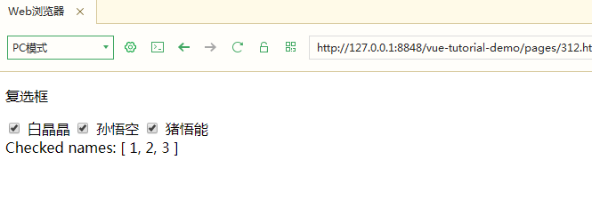
 
 #### v-model 实例：v-model双向绑定复选框用v-for方式
 
+ 新建立一个html，命名为313.html
+ 添加以下内容到html中


 ```html
 <div id="app">
 <p>复选框v-for</p>
 	<span v-for="item in items">			
 		<input type="checkbox"  :id="item.id" :value="item.id" v-model.lazy="checkedNames">
 		<label  :for="item.id">{{ item.name }}</label>
 	</span>
 	<br>
 	<span>Checked names: {{ checkedNames }}</span>			
 		
 </div>
 <script>
 	new Vue({
 		el: "#app",
 		data: {
 			checkedNames:[],
 			items:[
 				{id:1,name:"白晶晶"},
 				{id:2,name:"孙悟空"},
 				{id:3,name:"猪悟能"},
 			]										
 		}				
 	})
 </script>
 
 ```
 
效果和312.html案例一致

#### v-model 实例：v-model双向绑定input筛选
 
+ 新建立一个html，命名为314.html
+ 添加以下内容到html中


 ```html
 <div id="app">
   <input v-model='search' />
   <ul>
 	<li v-for="item in items">
 		<label>价格</label><span v-html="item.name"></span>
 		<label>￥</label><span v-html="item.price"></span>
   </ul>
 </div>
 <script type="text/javascript">
 	new Vue({
 	  el: '#app',
 	  data: {
 	    search: '',
 	    products: [{
 	      name: '苹果',
 	      price: 25
 	    }, {
 	      name: '香蕉',
 	      price: 15
 	    }, {
 	      name: '雪梨',
 	      price: 65
 	    }, {
 	      name: '宝马',
 	      price: 2500
 	    }, {
 	      name: '奔驰',
 	      price: 10025
 	    }, {
 	      name: '柑橘',
 	      price: 15
 	    }, {
 	      name: '奥迪',
 	      price: 25
 	    }]
 	  },
 	  computed: {
 	    items: function() {
 	      var _search = this.search;
 	      if (_search) {
 	        return this.products.filter(function(product) {
 	          return Object.keys(product).some(function(key) {
 	            return String(product[key]).toLowerCase().indexOf(_search) > -1
 	          })
 	        })
 	      }
 	
 	      return this.products;
 	    }
 	  }
 	})
 </script>	
 
 ```


### v-bind
v-bind指令用给HTML标签设置属性


 ```html
<!-- 完整语法 -->
<a v-bind:href="url"></a>
<!-- 缩写 -->
<a :href="url"></a>

 ```


 
#### v-model 实例：v-bind实例

+ 新建立一个html，命名为315.html
+ 添加以下内容到html中

 ```html
	<body>
		<div id="app">
			<p v-bind:id="id">v-bind绑定id属性</p>		
		
		</div>
		<script>
			var vm = new Vue({
				el: "#app",
				data: {
					id:'myid'									
				}				
			})
		</script>
		
	</body>
 ```	
 
 v-bind绑定了div的id为vue对象中的id属性，`<div id="myid">v-bind绑定id属性</div>`
 + 完整语法 `<p v-bind:id="id">v-bind绑定id属性</p>`
 + 简化语法 `<p :id="id">v-bind绑定id属性</p>`

 以上效果一致
 
 ### v-on
v-bind指令用给HTML标签设置属性

```html
<!-- 完整语法 -->
<button v-on:click="dothis"></button>
<!-- 缩写 -->
<button @click="dothis"></button>

 <!-- 阻止单击事件冒泡 -->
 <a v-on:click.stop="doThis"></a>
 <!-- 提交事件不再重载页面 -->
 <form v-on:submit.prevent="onSubmit"></form>
 <!-- 修饰符可以串联  -->
 <a v-on:click.stop.prevent="doThat"></a>
 <!-- 只有修饰符 -->
 <form v-on:submit.prevent></form>
 <!-- 添加事件侦听器时使用事件捕获模式 -->
 <div v-on:click.capture="doThis">...</div>
 <!-- 只当事件在该元素本身（比如不是子元素）触发时触发回调 -->
 <div v-on:click.self="doThat">...</div>
```

