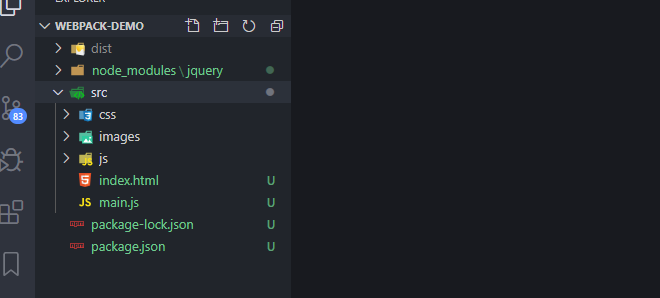

# webpack


## webpack案例项目


### webpack4安装

+ 全局安装：npm install  webpack -g


### 建立目录

+ 项目名称：建立文件夹webpack-demo
+ 建立项目目录：




+ 初始化npm安装包:npm init

+ 安装webpack-cli:我们在项目中本地安装webpack-cli：npm install webpack-cli -g

+ 新建入口js：index.js

+ webpack打包：直接运行webpack --mode development或者webpack --mode production


这样便会默认进行打包，入口文件是`'./src/index.js'`，输出路径是`'./dist/main.js'`，其中src目录即index.js文件需要手动创建，而dist目录及main.js会自动生成

这样便能够实现将`'./src/index.js'`打包成`'./dist/main.js'`。 

不过每次都要输入这个命令，非常麻烦，我们在package.json中scripts中加入两个成员：

```
"dev":"webpack --mode development",
 "build":"webpack --mode production"
 
```

以后我们只需要在命令行执行npm run dev便相当于执行webpack --mode development，执行npm run build便相当于执行webpack --mode production。

+ 在根目录执行：npm run dev

可以看到根目录下生成了dist目录，并且dist目录下生成了main.js文件，main.js文件已经打包了src目录下index.js文件的代码。

若执行命令报错：是因为运行权限不足

win+F : Windows PowerShell

点击以管理员运行，输入 set-ExecutionPolicy RemoteSigned

最后通过 get-ExecutionPolicy 查看当前的状态
